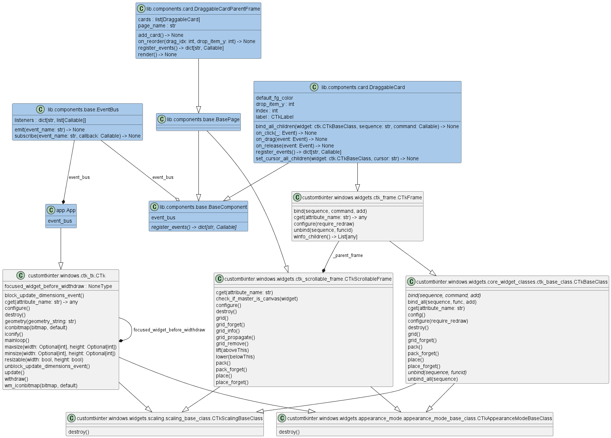

<!--
    README
 -->

 <div align=center>
  
</div>

# Customtkinter Draggable Demo

[](./README.md)
[](./README_JA.md)
[](./LICENSE)
[](https://mypy-lang.org/)
[](https://github.com/astral-sh/ruff)
[](https://github.com/astral-sh/uv)

[](https://github.com/python)
[](https://github.com/sphinx-doc/sphinx)
[](https://github.com/pytest-dev/pytest)
[](https://github.com/pydantic/pydantic)

This is a demo of drag-and-drop widget reorder using [CustomTkinter][customtkinter](Tkinter).

[customtkinter]: https://github.com/TomSchimansky/CustomTkinter

If you comment out the following in the `DraggableCard` class, the dragged widget will be swapped with the widget at the dropped location.

```python
self.bind_all_children(
    widget=self,
    sequence='<B1-Motion>',
    command=self.on_drag,
)
```

Also, the `EventBus` class can execute functions according to event names, reducing the dependency between classes.

## :rocket:Getting started

### Install from github

```bash
git clone https://github.com/r-dev95/customtkinter-draggable-demo.git
```

### Build virtual environment

It is assumed that `uv` is installed.

If you don't have a Python development environment yet, click [here](https://github.com/r-dev95/env-python).

```bash
cd customtkinter-draggable-demo/
uv sync
```

### Run

```bash
source .venv/bin/activate
cd src
python app.py
```

## :bookmark_tabs:Structure

<div align=center>
  
</div>

## :key:License

This repository is licensed under the [MIT License](LICENSE).
