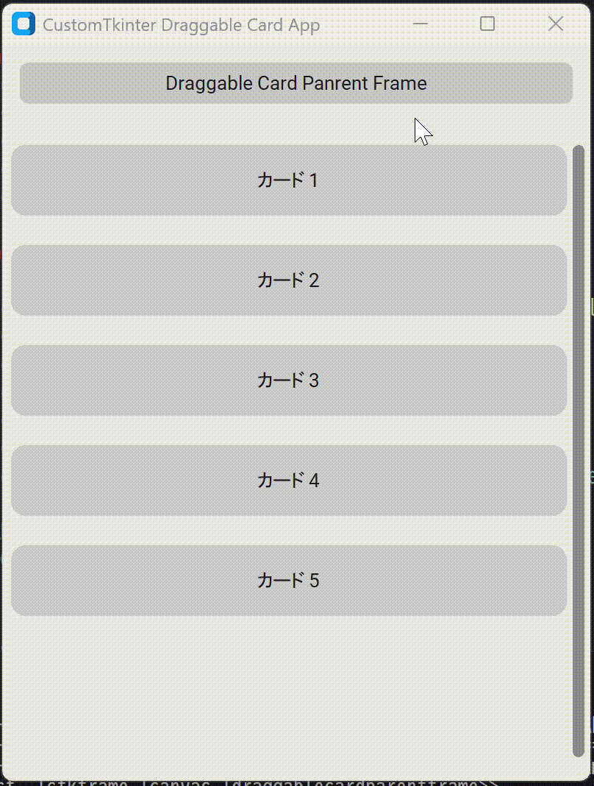

<!--
    README
 -->

 <div align=center>
  
</div>

# Customtkinter Draggable Demo

[](./README.md)
[](./README_JA.md)
[](./LICENSE)
[](https://mypy-lang.org/)
[](https://github.com/astral-sh/ruff)
[](https://github.com/astral-sh/uv)

[](https://github.com/python)
[](https://github.com/sphinx-doc/sphinx)
[](https://github.com/pytest-dev/pytest)
[](https://github.com/pydantic/pydantic)

[CustomTkinter][customtkinter](Tkinter)を用いた、ドラッグ&ドロップでウィジェットを並べ替えるデモを示します。

[customtkinter]: https://github.com/TomSchimansky/CustomTkinter

`DraggableCard`クラスの下記をコメントアウトすると、ドラッグしたウィジェットとドロップした箇所のウィジェットとの交換処理になります。

```python
self.bind_all_children(
    widget=self,
    sequence='<B1-Motion>',
    command=self.on_drag,
)
```

また`EventBus`クラスでイベント名に応じた関数を実行できるようにすることで、クラス間の依存度を下げるような設計としています。

## :rocket:Getting started

### githubからインストール

```bash
git clone https://github.com/r-dev95/customtkinter-draggable-demo.git
```

### 仮想環境の構築

`uv`がインストールされていることが前提です。

pythonの開発環境がまだ整っていない方は、[こちら](https://github.com/r-dev95/env-python)。

```bash
cd customtkinter-draggable-demo/
uv sync
```

### 実行

```bash
source .venv/bin/activate
cd src
python app.py
```

## :bookmark_tabs:構成

<div align=center>
  
</div>

## :key:ライセンス

本リポジトリは、[MIT License](LICENSE)に基づいてライセンスされています。
